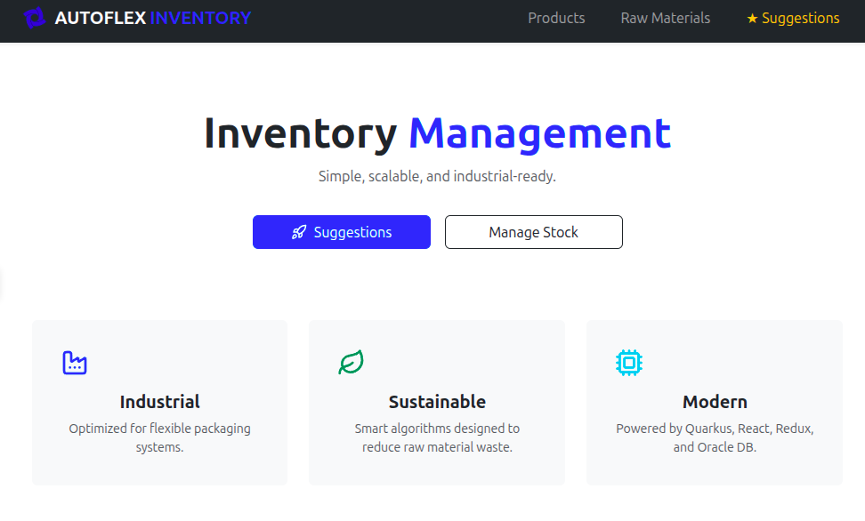
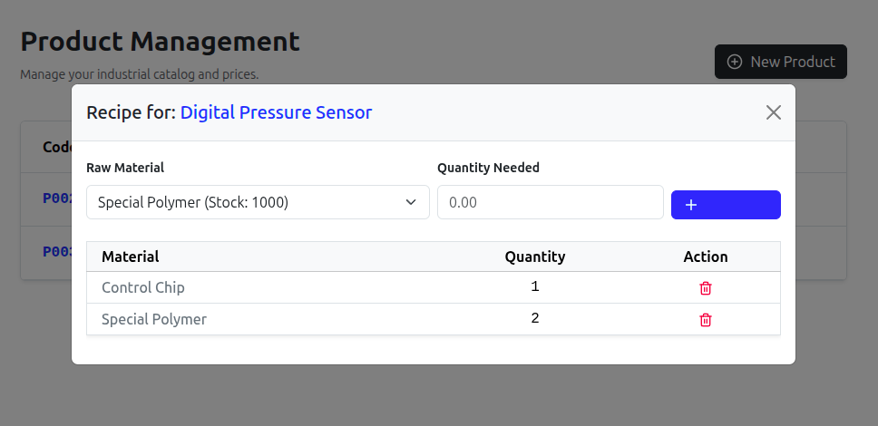

# Autoflex Inventory Manager 🏭

An industrial-grade Full Stack application designed for resource management and production optimization.


## 1. 🏗 Architecture & Technologies

The system is built on a modern, decoupled architecture (RNF002) prioritizing performance and data integrity:

- **Backend:** Java 21 & Quarkus (High-performance native Java framework).
- **Frontend:** React 18 with Redux Toolkit (State management and reactive UI).
- **Database:** Oracle Database 23c (Enterprise relational standard).
- **Infrastructure:** Docker & Docker Compose (Containerization and orchestration).
- **Style:** Bootstrap 5 & SweetAlert2.

## 2. 💡 Key Logic: Smart Production Suggestion 

The heart of this application is the **Production Suggestion Engine**. It uses a **Greedy Optimization Algorithm** to calculate maximum production capacity:
1. **Prioritization:** Orders products by unit price (highest value first).
2. **Resource Check:** Recursively analyzes raw material stock vs. product composition (recipes).
3. **Inventory Simulation:** Deducts stock virtually for each product suggested to ensure accurate totals and maximize profit.


## 3. 📱 Preview

### Desktop Dashboard


### Form for Product


## 4. 🚀 Quick Start (Production Setup)

The entire environment is orchestrated via Docker. No manual database or server installation is required.

1. **Clone the repository:**
   ```bash
   git clone [https://github.com/jotor-dev/inventory-manager.git](https://github.com/jotor-dev/inventory-manager.git)
   cd inventory-manager
2. **Build the artifacts:**
  ```bash
    cd backend-quarkus
    ./mvnw clean package -DskipTests
    cd ..
  ```
3. **Launch the infrastructure:**
```bash
docker-compose up --build
```
4. **Access the Application:**
* **Frontend (UI):** http://localhost
* **Backend (API):** http://localhost:8080
* **Database (Oracle):** `localhost:1521` (User: `system` / Pass: `123`)

## 5. 📝 Notes

* **Persistence:** Docker volumes are used (`oracle_data`).
* **CORS:** Configured to allow communication between the Nginx container (port 80) and the Quarkus API (port 8080).
* **Cascade Logic:** Implemented `CascadeType.ALL` on Product entities to ensure data integrity during industrial record deletions.
